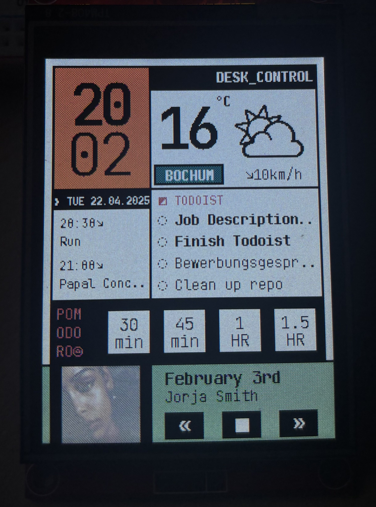
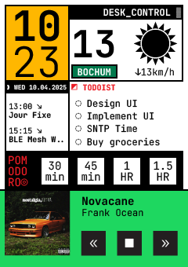
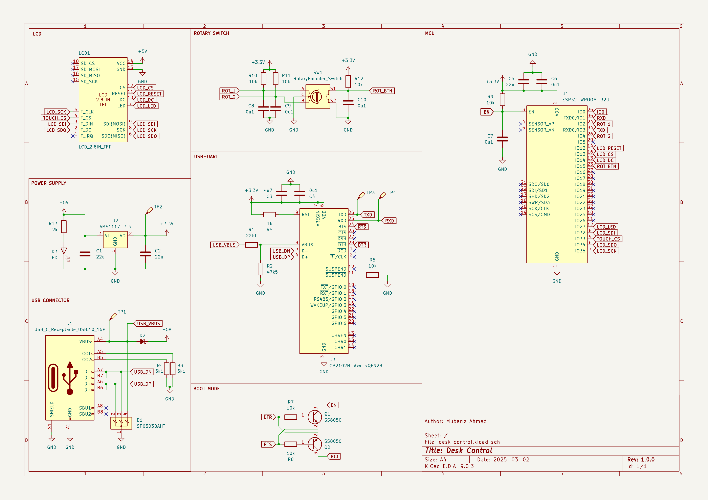
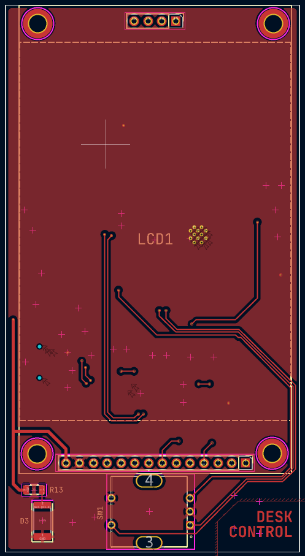
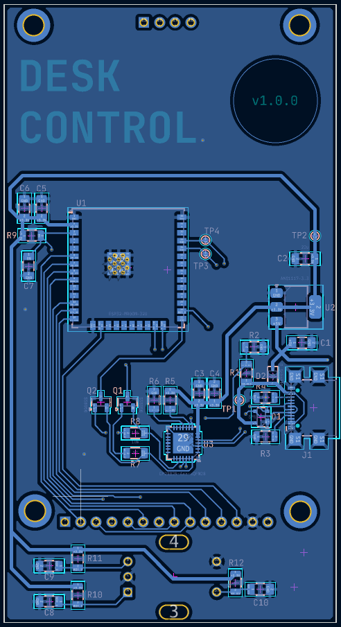
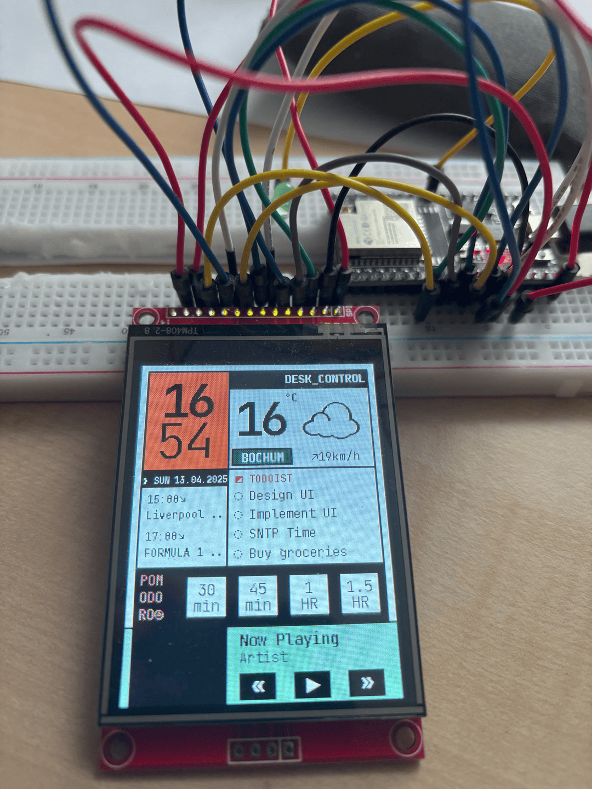

# desk-control

This is a simple physical widget that sits on your desk and allows you to perform some basic productivity tasks. It works independently of your computer or phone and hence, _in theory_, it should help you focus on your work. It is a work in progress and I will be adding more features as I go along.

  
  

## Features

- **Current Time** - Displays the current time in a 24-hour format.
- **Weather** - Displays the current temperature, wind, and weather condition (sunny, cloudy, etc.) for a given location.
- **Pomodoro Timer** - A simple timer that helps you focus on your work for a some template amount of time and then take a break. Current implementation is 25 minutes of work and 5 minutes of break. You can change this in the code.
- **Calendar** - Displays the current date and the next 2 events from your Google Calendar. You need to set up a Google script to get the events from your calendar. See the [Google Calendar Setup](#google-calendar-setup) section below.

- **Spotify Control** - Control your Spotify playback (play, pause, next, previous) from the widget.

- **Todoist Integration** - View and complete your upcoming tasks from Todoist.

- **PCB Design** - Single PCB design that can be printed on PCBWay or JLCPCB.

## Planned Features

- **Housing** - 3D printed housing for the PCB and screen.

- **Sensor Integration** - Add more sensors to the project - maybe a temperature sensor, humidity sensor, etc. to get more data from the environment.

- **Widget Details** - Widgets will be clickable and will show more details about the current state. For example, the weather widget will show the hourly forecast for the next 24 hours, the calendar widget will show the events for the next week, etc.

## Hardware Setup (Work in Progress)

The hardware setup is a work in progress. I will be updating this section as I go along. Currently, the hardware setup is:

- **Microcontroller** - ESP32-DevKitC-v4
- **Display** - 2.4" TFT LCD (ILI9341) with SPI interface
- **Rotary Encoder** - KY-040 rotary encoder with push button.

A custom PCB has been designed but not yet tested. The schematic and KiCAD project files are available in the `eda` folder.

  

[Schematic](eda/desk_control_schematic_color.png)

  
  

[PCB Front](eda/front.png) | [PCB Back](eda/back.png)

[KiCAD Project](eda/desk_control)

Pin definitions are given in [here](/main/pin_definitions.h).

## Software Setup

ESP IDF is used to program the ESP32. The project can be configured using `idf.py menuconfig`. The following configuration options are most relevant:

- **ESP_WIFI_SSID** - The SSID of the Wi-Fi network to connect to.
- **ESP_WIFI_PASSWORD** - The password of the Wi-Fi network to connect to.
- **CALENDAR_URL** - The URL of the Google script that returns the events from your calendar.

## Mock UI

The mock UI is a simple representation of what the final UI will look like. It is not a final design and will be updated as I go along. The current design is a simple grid layout with a monotype font which makes absolute positioning of the elements easy.

  

## Progress

The project is being prototyped on a breadboard and the hardware setup is a work in progress. The software is being developed in parallel. The current status of the project is shown below:

  

## Google Calendar Setup

To get the events from your Google Calendar, you need to set up a Google script that will fetch the events and return them in a JSON format. The script should be deployed as a web app and the URL should be added to the code. The following steps will help you set up the Google script:

1. Go to [Google Apps Script](https://script.google.com/) and create a new project.
2. Copy and paste the code from this (file)[https://github.com/mubarizahmed/desk_control/blob/main/other/calendar.gs] into the script editor
3. Save the project and give it a name.
4. Click on the `Deploy` button and select `New deployment`.
5. Select `Web app` and give it a name.
6. Select `Anyone` under `Who has access` and click on `Deploy`.
7. Authorize the script to access your Google Calendar.
8. Copy the URL of the web app and paste it in the code where it says `CALENDAR_URL`.
9. Save the code and run the script to test it. You should see the events from your calendar in the JSON format.

Thanks to this [blog post](https://www.instructables.com/E-Ink-Family-Calendar-Using-ESP32/) for the idea and the code to get the events from the Google Calendar. The code has been modified to fit the needs of this project.

## Acknowledgements

Thanks to [wttr.in](https://wttr.in/) for the weather API and [Google Calendar API](https://developers.google.com/calendar) for the calendar API.
